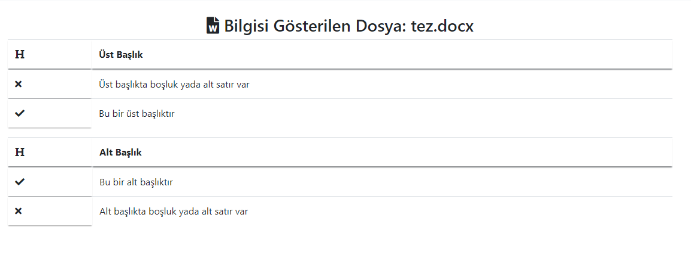
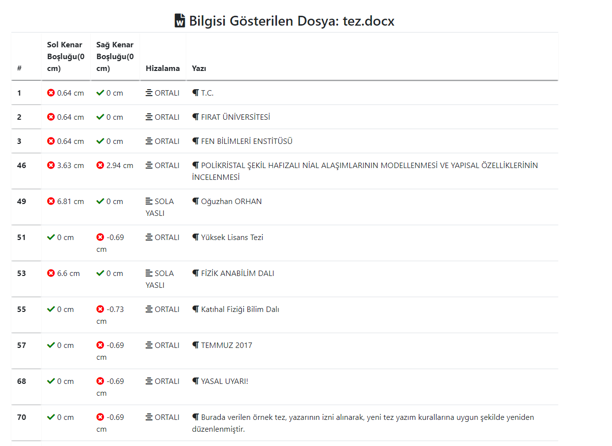

# Check True

Python Flask frameworkunu kullanarak word dosyasında istediğimiz işlemleri yapmak için oluşturduğum web arayüzüdür.

İlk olarak ana dosya dizininde aşağıdaki satırı komut satırınızda çalıştırın:

```shell
>python app.py
```

ardından `localhost:5000` adresini tarayıcınızda ziyaret edin. Sizleri `Resim 1` deki gibi bir ekran kaşılayacaktır.


> Resim 1 - Sistemin ana sayfasının bir görünümü.

Dosya Seç butonunu kullanarak docx/doc seçin ve Yükle ve Analiz Et butonuna tıklayın. Ardından seçtiğiniz/görmek istediğiniz dosya özelliğine göre aşağıdaki ekran ile karşılaşacaksınız.


> Resim 2 - Dosya özelliklerinin görünümü



> Resim 3 - Dosyada bulunan alt ve üst başlıkların kontrolu


> Resim 4 - Dosyada bulunan paragrafların listesi ve bulundukları sıra numarası


> Resim 5 - Kenar boşlukları ve yönlendirmeye dair bilgilerin bulunduğu ekran



> Resim 6 - Dosyada bulunan her bir paragrafın durumun gösterildiği ekran

**Proje hala geliştirilme aşamasındadır.!**
